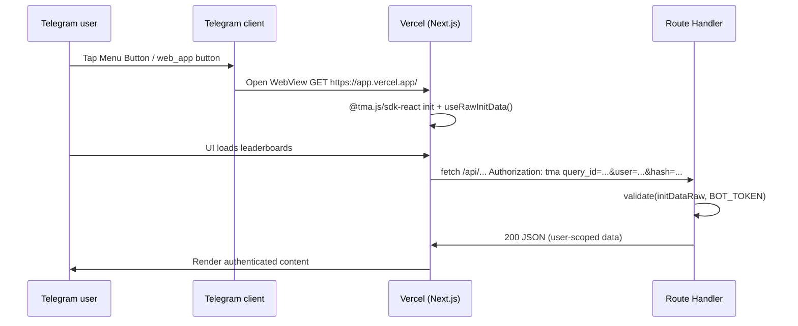

# Research: Next.js Mini App authentication on Vercel

**Ticket:** mike-bot v2 wayfinder — issue 02  
**Question:** How does a Next.js Mini App authenticate on Vercel?

**Primary sources:**

- [Telegram Mini Apps — Init Data](https://docs.telegram-mini-apps.com/platform/init-data)
- [Telegram Mini Apps — Launch Parameters](https://docs.telegram-mini-apps.com/platform/launch-parameters)
- [Telegram Mini Apps — Creating New App / BotFather](https://docs.telegram-mini-apps.com/platform/creating-new-app)
- [Telegram Mini Apps — Getting App Link (HTTPS)](https://docs.telegram-mini-apps.com/platform/getting-app-link)
- [@tma.js/sdk-react](https://docs.telegram-mini-apps.com/packages/tma-js-sdk-react)
- [@tma.js/init-data-node](https://docs.telegram-mini-apps.com/packages/tma-js-init-data-node)
- [core.telegram.org — Telegram Mini Apps / validating initData](https://core.telegram.org/bots/webapps#validating-data-received-via-the-mini-app)
- [Next.js Route Handlers](https://nextjs.org/docs/app/api-reference/file-conventions/route)

**Pattern reference (non-authoritative):** `/tmp/redesigned-giggle` (TanStack Start; same `tma` header + `@tma.js/init-data-node` pattern).

---

## Summary

Telegram Mini Apps authenticate users via **signed init data**, not cookies or OAuth inside the WebView.

1. **Telegram injects init data** into the Mini App URL hash (`tgWebAppData=…`) when the WebView opens.
2. **Client (React)** reads the raw query string with `@tma.js/sdk-react` (`useRawInitData` / `retrieveRawInitData`) and sends it on every API call as `Authorization: tma <rawInitData>`.
3. **Server (Next.js Route Handler on Vercel)** reads that header, validates the HMAC signature with the **bot token** via `@tma.js/init-data-node`, optionally enforces `auth_date` expiry, then trusts the parsed `user` object.
4. **BotFather** must point the Menu Button and/or Mini App link at the **production HTTPS URL** (e.g. `https://<project>.vercel.app`).
5. **Vercel** supplies HTTPS + valid TLS automatically; store `BOT_TOKEN` (and any webhook secrets) in project Environment Variables — never expose the token to the client.

There is no separate “login” step: if init data validates, the request is from a real Telegram user for this bot.

---

## Authentication model

| Layer | Mechanism |
| --- | --- |
| Identity | Telegram user embedded in init data (`user.id`, name, etc.) |
| Proof | HMAC-SHA256 signature (`hash` field) signed with bot secret |
| Transport | `Authorization: tma <url-encoded-init-data-query-string>` |
| Trust boundary | Server only — never trust `initDataUnsafe` or parsed client-side data for authorization |

From [core.telegram.org](https://core.telegram.org/bots/webapps):

> Send the data from the `Telegram.WebApp.initData` field to the bot's backend. … Compare the received `hash` parameter with the HMAC-SHA-256 signature of the data-check-string with the secret key, which is the HMAC-SHA-256 signature of the bot's token with the constant string `WebAppData` used as a key.

Also check `auth_date` (Unix timestamp) to reject stale payloads ([docs.telegram-mini-apps.com](https://docs.telegram-mini-apps.com/platform/init-data) recommends this).

---

## Client: get raw initData in React

### Bootstrap

Install and initialize the SDK in a client component tree:

```bash
pnpm add @tma.js/sdk-react
```

```tsx
'use client'

import { init, initData } from '@tma.js/sdk-react'
import { useEffect } from 'react'

export function TelegramProvider({ children }: { children: React.ReactNode }) {
  useEffect(() => {
    init()           // bind to Telegram WebApp bridge
    initData.restore() // restore init data from launch params (URL hash)
  }, [])

  return <>{children}</>
}
```

Telegram passes launch params in `window.location.hash` ([launch parameters docs](https://docs.telegram-mini-apps.com/platform/launch-parameters)). The SDK reads `tgWebAppData` from there.

### Read raw init data

**Hook (React):**

```tsx
import { useRawInitData } from '@tma.js/sdk-react'

function ApiConsumer() {
  const initDataRaw = useRawInitData()
  // e.g. query_id=...&user=%7B...%7D&auth_date=...&hash=...
}
```

**Imperative (outside React / fetch helpers):**

```ts
import { retrieveRawInitData } from '@tma.js/sdk-react'

const initDataRaw = retrieveRawInitData()
```

Docs note `useRawInitData` wraps `retrieveRawInitData` and returns the init data in its **initial wire format** (URL query string).

**Do not use for auth decisions on the client:**

- `Telegram.WebApp.initDataUnsafe` / parsed `initData.state` — fine for UI (locale, theme), not for security ([core.telegram.org](https://core.telegram.org/bots/webapps)).
- Re-serializing parsed objects — send the **raw string unchanged** so the server hash check matches.

### Attach init data to backend requests

Recommended pattern from [init data docs](https://docs.telegram-mini-apps.com/platform/init-data):

```ts
const initDataRaw = retrieveRawInitData()

await fetch('/api/me', {
  headers: {
    Authorization: `tma ${initDataRaw}`,
  },
})
```

Send on **every** authenticated request (or centralize in a fetch wrapper / React Query helper). Pattern in redesigned-giggle: `useInitDataQuery` + `Authorization: tma ${rawInitData}`.

---

## Server: validate initData with bot token

### Library

```bash
pnpm add @tma.js/init-data-node
```

Server-only — never import in client bundles.

### Validation algorithm (official)

From [docs.telegram-mini-apps.com/platform/init-data](https://docs.telegram-mini-apps.com/platform/init-data):

1. Parse init data as query params; exclude `hash`, keep it for comparison.
2. Sort remaining `key=value` pairs alphabetically; join with `\n`.
3. `secret_key = HMAC_SHA256(bot_token, "WebAppData")` (key is the string `WebAppData`).
4. `computed_hash = HMAC_SHA256(data_check_string, secret_key)` as hex.
5. Compare `computed_hash` to `hash`.
6. Optionally reject if `auth_date` is too old.

`@tma.js/init-data-node` implements this:

```ts
import { validate, parse } from '@tma.js/init-data-node'

const botToken = process.env.BOT_TOKEN!

validate(initDataRaw, botToken, {
  expiresIn: 3600, // seconds; checks auth_date freshness
})

const initData = parse(initDataRaw)
const user = initData.user // Telegram user for this session
```

`validate()` throws on bad signature or expiry; `parse()` returns typed fields (`user`, `chat`, `start_param`, etc.).

### Next.js App Router Route Handler

Route Handlers use the Web `Request` / `Response` APIs ([Next.js docs](https://nextjs.org/docs/app/api-reference/file-conventions/route)). Read headers from the incoming request:

```ts
// app/api/me/route.ts
import { validate, parse } from '@tma.js/init-data-node'

const TMA_PREFIX = /^tma\s+/i

export async function GET(request: Request) {
  const auth = request.headers.get('authorization')
  if (!auth || !TMA_PREFIX.test(auth)) {
    return Response.json(
      { error: 'Missing or invalid Authorization header (expected tma <initData>)' },
      { status: 401 },
    )
  }

  const initDataRaw = auth.replace(TMA_PREFIX, '').trim()
  if (!initDataRaw) {
    return Response.json({ error: 'Empty init data' }, { status: 400 })
  }

  try {
    validate(initDataRaw, process.env.BOT_TOKEN!, { expiresIn: 3600 })
    const { user } = parse(initDataRaw)
    if (!user) {
      return Response.json({ error: 'User not in init data' }, { status: 404 })
    }
    return Response.json({ user })
  } catch {
    return Response.json({ error: 'Init data validation failed' }, { status: 401 })
  }
}
```

Notes for Next.js on Vercel:

- Route Handlers run on the server (Node.js or Edge). `@tma.js/init-data-node` needs Node crypto — use the **Node.js runtime** (default), not Edge, unless you confirm Edge compatibility.
- Access env via `process.env.BOT_TOKEN` — Vercel injects env vars at runtime.
- Same handler pattern works for `POST`, `PUT`, etc.; read `request.headers.get('authorization')` identically.

Alternative: `NextRequest` from `next/server` exposes the same `headers` API.

---

## Authorization header pattern: `tma ...`

Convention documented in [@tma.js/init-data-node](https://docs.telegram-mini-apps.com/packages/tma-js-init-data-node):

```
Authorization: tma <auth-data>
```

| Part | Value |
| --- | --- |
| Scheme | `tma` (Telegram Mini App) |
| Credentials | Full raw init data query string, **as received** from Telegram |

Server steps:

1. Read `Authorization` header.
2. Split on first space; scheme must be `tma`.
3. Remainder is init data; validate + parse.

This is **not** a Bearer JWT — it is the signed Telegram payload itself, re-sent on each request.

---

## BotFather configuration

Mini Apps are tied to a **Telegram bot**. The bot token used for webhook/API is the same token used to validate init data.

### Prerequisites

- Bot created via `@BotFather` → `/newbot`
- Mini App registered via `/newapp` (optional if using Menu Button only as web UI) — yields `https://t.me/{bot}/{appname}` ([creating-new-app](https://docs.telegram-mini-apps.com/platform/creating-new-app))

### Set the Mini App URL (production)

Production requires **HTTPS with a valid SSL certificate** ([getting-app-link](https://docs.telegram-mini-apps.com/platform/getting-app-link)). Plain HTTP and raw IPs are rejected in production (test environment allows HTTP/IP).

**Menu Button** (primary UX for mike-bot: open from bot chat):

1. Message `@BotFather` → `/setmenubutton`
2. Select bot
3. Enter button label (e.g. "Leaderboards")
4. Enter Mini App URL: `https://<vercel-deployment-domain>/` (trailing slash optional; must match what Vercel serves)

Alternative path: **Bot Settings → Menu Button** ([core.telegram.org](https://core.telegram.org/bots/webapps#launching-mini-apps-from-the-menu-button)).

Per-user overrides: Bot API [`setChatMenuButton`](https://core.telegram.org/bots/api#setchatmenubutton).

**Direct app link** (for `https://t.me/{bot}/{appname}`):

1. `/myapps` → select app → **Edit link** → paste HTTPS URL

**Main Mini App** (profile "Launch app" button):

- `@BotFather` → bot → **Main Mini App** setup ([core.telegram.org](https://core.telegram.org/bots/webapps#launching-the-main-mini-app))
- Opens via `https://t.me/botusername?startapp` with optional `start_param`

**Other entry points** (same init data auth once open):

- Inline keyboard `web_app` button
- Keyboard `web_app` button
- Direct link `https://t.me/botusername/appname?startapp=...`

All paths inject the same signed init data into the WebView; server validation is identical.

### URL must match deployment

BotFather URL must be the **live** Vercel URL users hit. Preview deployments (`*.vercel.app` per branch) need their own BotFather entry or a stable production alias. For mike-bot v2, point BotFather at the production `v2` deployment URL once provisioned (see issue 14).

---

## Vercel deployment requirements

### HTTPS

Vercel provides HTTPS and managed TLS for `*.vercel.app` and custom domains. This satisfies Telegram production requirements ([getting-app-link](https://docs.telegram-mini-apps.com/platform/getting-app-link)).

No extra cert setup for default Vercel hosting.

### Environment variables

| Variable | Purpose | Exposure |
| --- | --- | --- |
| `BOT_TOKEN` | Validate init data HMAC; Grammy webhook | **Server only** — Vercel env, never `NEXT_PUBLIC_*` |
| `WEBHOOK_SECRET` (if used) | Verify Telegram webhook requests | Server only |
| Database / other backend secrets | API routes after auth | Server only |

Set in Vercel: **Project → Settings → Environment Variables** for Production (and Preview if testing webhooks/previews).

The Mini App **client never receives** the bot token. Only raw init data (already signed by Telegram) goes to the server.

### Next.js layout

Typical mike-bot v2 shape:

```
app/
  layout.tsx          # wraps Mini App UI
  page.tsx            # client Mini App (leaderboards)
  api/
    me/route.ts       # GET — validate tma header, return user
    .../route.ts      # other authenticated endpoints
```

- Mini App UI: client components + `@tma.js/sdk-react`
- Auth API: Route Handlers under `app/api/**/route.ts`
- Grammy webhook: separate Route Handler (e.g. `app/api/bot/route.ts`) — different auth (Telegram webhook secret), not `tma` header

### CORS

Mini App `fetch('/api/...')` is **same-origin** when the UI and API share the Vercel deployment domain — no CORS config needed. Cross-origin APIs would need explicit CORS headers ([Next.js Route Handler CORS example](https://nextjs.org/docs/app/api-reference/file-conventions/route#cors)).

### Local / preview development

- **Production Telegram:** BotFather URL must be HTTPS → use Vercel preview URL or ngrok/localtunnel ([getting-app-link](https://docs.telegram-mini-apps.com/platform/getting-app-link)).
- **Test environment:** Telegram test server allows HTTP/IP for BotFather links ([test environment](https://docs.telegram-mini-apps.com/platform/test-environment)).

---

## End-to-end flow



---

## Security checklist

- [ ] Validate every protected API call with `@tma.js/init-data-node` — no trust of client-parsed user id alone
- [ ] Set `expiresIn` on `validate()` (e.g. 3600s) using `auth_date`
- [ ] Keep `BOT_TOKEN` server-side only
- [ ] Use HTTPS production URL in BotFather
- [ ] Do not log full init data in production (contains user PII)
- [ ] Treat init data as a bearer credential for the session lifetime in the WebView; re-send on each request rather than issuing your own session cookie unless you add extra binding

---

## Implications for mike-bot v2

1. **Wayfinder / Mini App:** Client uses `useRawInitData()`; all leaderboard API routes use the `tma` header pattern.
2. **Same bot token** as Grammy webhook validates init data — one `BOT_TOKEN` env var on Vercel.
3. **BotFather:** After Vercel project exists, set Menu Button URL to the deployment HTTPS origin (issue 14).
4. **No `/stats` text command** for auth — identity comes from validated init data only.
5. **redesigned-giggle** confirms the stack choice: `validate` + `parse` from `@tma.js/init-data-node`, `Authorization: tma ${initDataRaw}` from client — adapt handlers from TanStack Start to Next.js `route.ts`.

---

## References

- Init data & `tma` header: https://docs.telegram-mini-apps.com/platform/init-data  
- SDK React hooks: https://docs.telegram-mini-apps.com/packages/tma-js-sdk-react  
- Server validation: https://docs.telegram-mini-apps.com/packages/tma-js-init-data-node  
- BotFather setup: https://docs.telegram-mini-apps.com/platform/creating-new-app  
- HTTPS requirement: https://docs.telegram-mini-apps.com/platform/getting-app-link  
- Telegram WebApp validation: https://core.telegram.org/bots/webapps#validating-data-received-via-the-mini-app  
- Next.js Route Handlers: https://nextjs.org/docs/app/api-reference/file-conventions/route  
